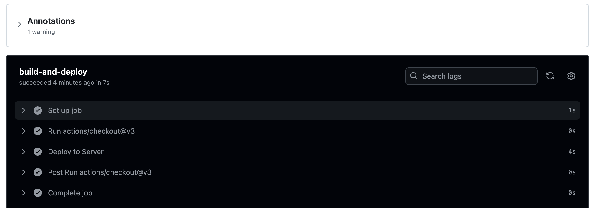

# Lab Tutorial: Deploying to AWS EC2 with GitHub Actions

## 1. Introduction

Amazon Elastic Cloud Compute (EC2) is a fundamental service offered by Amazon Web Service (AWS) that provides scalable computing resources in the form of virtual servers (instances) that run applications.

GitHub Actions is a CI/CD platform that enables software development workflow automation directly in a GitHub repository. It creates a pipeline where code changes are automatically built, tested, and deployed to a live environment, i.e., an EC2 instance.

There are different methods for deploying directly to AWS EC2 using GitHub Actions:

- **Secure Shell (SSH)**
- **easingthemes/ssh-deploy action**

In this tutorial, we’ll cover EC2 instance configuration, SSH key management, workflow creation, and best practices for ensuring secure and reliable deployments.

---

## 2. Environment Setup

Before deploying any application, we set up an environment in both GitHub and AWS.

### 2.1. GitHub Setup

To host the code to be deployed, let’s create a repository named `github-actions-ec2` using the GitHub GUI:


```bash
git clone https://github.com/<username>/github-actions-ec2.git
```

Create a `.github/workflows` directory:

```bash
cd github-actions-ec2
mkdir -p .github/workflows
```

Create a `deploy.yml` file:

```bash
touch .github/workflows/deploy.yml
```

Set up a simple Node.js-Express application:

```bash
mkdir -p simple-web-server/
cd simple-web-server
npm init -y
npm install express
```

Example `server.js` content:

```javascript
const express = require('express');
const app = express();
const port = process.env.PORT || 3000;

app.get('/', (req, res) => {
  res.send('Hello World! This server is running on Node.js with Express.');
});

app.get('/info', (req, res) => {
  res.json({
    name: 'Simple Web Server',
    version: '1.0.0',
    uptime: process.uptime()
  });
});

app.listen(port, () => {
  console.log(`Server running at http://localhost:${port}`);
});
```

Update `package.json` scripts section:

```json
{
  "name": "simple-web-server",
  "version": "1.0.0",
  "description": "",
  "main": "server.js",
  "scripts": {
    "test": "echo \"Error: no test specified\" && exit 1",
    "start": "node server.js"
  }
}
```

Add a `.gitignore`:

```plaintext
simple-web-server/node_modules/
```

Run the server locally:

```bash
npm start
```

Commit and push changes:

```bash
git add .
git commit -m "NodeJS-Express Application"
git push
```

### 2.2. AWS Setup

Set up an AWS EC2 instance named `github-actions-ec2-instance`, select Ubuntu AMI, use `t2-micro` instance type, and create a key pair for SSH access. Modify security group for SSH and TCP traffic on ports 22 and 3000. Launch the instance and confirm its running status.


---

## 3. Using SSH

Create a continuous deployment pipeline using GitHub Actions and SSH.


### 3.1. Secret Variables

Store secrets like the EC2 instance's hostname, username, and private key as GitHub secrets.


First, **let’s store the username as *EC2_USER***:


After that, **we store the hostname as *EC2_HOST***:


Then, **we copy the content of the *github-ec2-instance-key.pem* downloaded earlier and store it as *EC2_PRIVATE_KEY***:


### 3.2. Script Setup

Configure the `deploy.yml` file for SSH deployment:

```yaml
name: Deploy to EC2

on:
  push:
    branches: [ main ]

jobs:
  deploy:
    runs-on: ubuntu-latest
    steps:
    - uses: actions/checkout@v2

    - name: Deploy to EC2
      env:
        PRIVATE_KEY: ${{ secrets.EC2_PRIVATE_KEY }}
        HOST: ${{ secrets.EC2_HOST }}
        USER: ${{ secrets.EC2_USER }}
      run: |
        echo "$PRIVATE_KEY" > github-ec2.pem && chmod 600 github-ec2.pem
        ssh -o StrictHostKeyChecking=no -i github-ec2.pem ${USER}@${HOST} '
        echo "Current directory: $(pwd)"
        echo "Listing home directory:"
        ls -la ~

        echo "Installing Node.js..."
        if ! command -v nvm &> /dev/null; then
          curl -o- https://raw.githubusercontent.com/nvm-sh/nvm/v0.39.5/install.sh | bash
          export NVM_DIR="$HOME/.nvm"
          [ -s "$NVM_DIR/nvm.sh" ] && \. "$NVM_DIR/nvm.sh"  # This loads nvm
        fi
        nvm install node

        echo "Installing PM2..."
        if ! command -v pm2 &> /dev/null; then
        npm install -g pm2
        fi

        REPO_URL="https://github.com/tycloud97/github-aws-ec2.git"
        BRANCH="main"
        REPO_DIR="$HOME/github-aws-ec2"

        if [ -d "$REPO_DIR/.git" ]; then
          cd "$REPO_DIR"
          git pull origin "$BRANCH"
        else
          git clone "$REPO_URL" "$REPO_DIR"
          cd "$REPO_DIR"
        fi

        cd "$REPO_DIR/simple-web-server"
        npm install

        cd ~/github-aws-ec2/simple-web-server
        git pull origin main
        npm install

        echo "Starting/restarting application..."
        pm2 restart server.js || pm2 start server.js
        '
```

Push the changes:

```bash
git add .
git commit -m "Deploy Node.js application to EC2"
git push
```

### 3.3. Testing the Deployment

Use curl or browser to test deployment on EC2 instance's IP address.


---

## 4. Using easingthemes/ssh-deploy Action

Automate deployment with the easingthemes/ssh-deploy action using SSH and rsync.

### 4.1. Configuration Setup

Understand configuration variables for deployment via rsync over SSH.

### 4.2. Usage in Workflow

Store variables as GitHub secrets, update `deploy.yml` with easingthemes/ssh-deploy action:

- *SSH_PRIVATE_KEY*: server private key
- *REMOTE_HOST*: server public DNS name
- *REMOTE_USER*: server username
- *REMOTE_TARGET*: *~/simple-web-server*


```yaml
name: Node CI

on: [push]

jobs:
  build-and-deploy:

    runs-on: ubuntu-latest

    steps:
    - uses: actions/checkout@v3

    - name: Deploy to Server
      uses: easingthemes/ssh-deploy@main
      with:
          SSH_PRIVATE_KEY: ${{ secrets.SSH_PRIVATE_KEY }}
          ARGS: "-rlgoDzvc -i --delete"
          SOURCE: "simple-web-server/"
          REMOTE_HOST: ${{ secrets.REMOTE_HOST }}
          REMOTE_USER: ${{ secrets.REMOTE_USER }}
          TARGET: ${{ secrets.REMOTE_TARGET }}
          EXCLUDE: "/dist/, /node_modules/"
          SCRIPT_BEFORE: |
            whoami
            ls -al
            mkdir -p ${{ secrets.REMOTE_TARGET }}
          SCRIPT_AFTER: |
            cd ${{ secrets.REMOTE_TARGET }}
            ls -al

            echo "Installing Node.js..."
            if ! command -v nvm &> /dev/null; then
              curl -o- https://raw.githubusercontent.com/nvm-sh/nvm/v0.39.5/install.sh | bash
              export NVM_DIR="$HOME/.nvm"
              [ -s "$NVM_DIR/nvm.sh" ] && \. "$NVM_DIR/nvm.sh"  # This loads nvm
            fi
            nvm install node

            echo "Installing PM2..."
            if ! command -v pm2 &> /dev/null; then
            npm install -g pm2
            fi

            npm install

            echo "Starting/restarting application..."
            pm2 restart server.js || pm2 start server.js
```

Push the workflow:

```bash
git add .
git commit -m "Deploy to EC2 using easingthemes/ssh-deploy"
git push
```

### 4.3. Testing the Deployment

Verify deployment using the instance's IP address in a web browser or curl command.





---

## 5. Conclusion

In this article, we've demonstrated how to deploy directly to AWS EC2 using GitHub Actions by deploying a NodeJS-Express application. We explored two methods: SSH and easingthemes/ssh-deploy action. Using GitHub Actions saves time, reduces potential errors, and provides a foundation for scaling and improving deployment strategies.